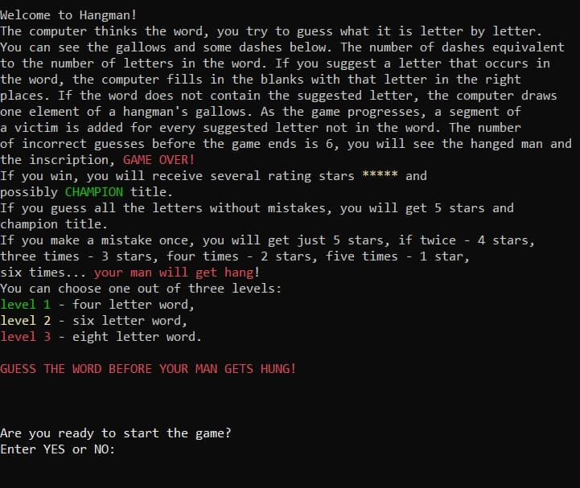
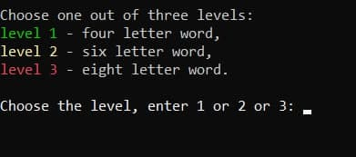
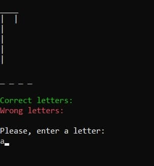
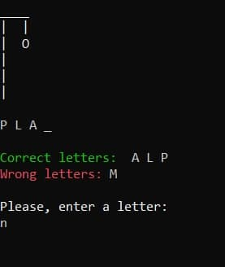
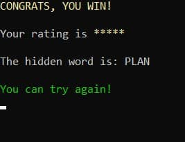

#Hangman game

---
    This is a CMD game 'Hangman'.
    It is a guessing game. Computer thinks of a word, the user
    tries to gess it letter by letter.
    This game has 3 levels: easy (4-letters word),
    medium(6-letters word) and hard(8-letters word).
---

